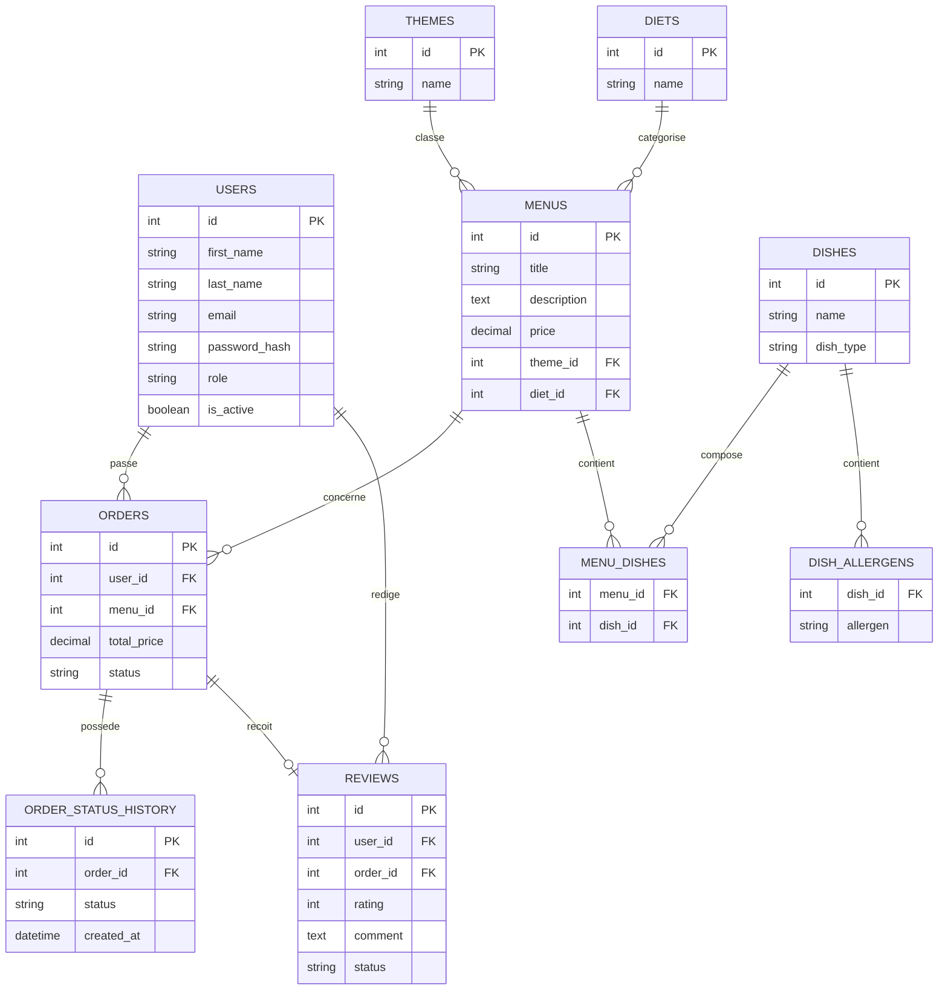

# Base de données

## Introduction

L'application **Vite & Gourmand** repose sur deux systèmes de gestion de bases de données complémentaires :

* **MySQL**, utilisé pour stocker les données principales de l'application (utilisateurs, menus, commandes, avis, etc.).
* **MongoDB**, utilisé pour enregistrer des données statistiques destinées au tableau de bord administrateur.

Ce choix permet de bénéficier des avantages de chaque technologie : MySQL assure la gestion des données relationnelles, tandis que MongoDB facilite le stockage et l'exploitation de données analytiques.

| Table                  | Rôle                                              |
| ---------------------- | ------------------------------------------------- |
| `users`                | Comptes utilisateurs, employés et administrateurs |
| `menus`                | Menus proposés                                    |
| `themes`               | Thèmes des menus                                  |
| `diets`                | Régimes alimentaires                              |
| `dishes`               | Plats composant les menus                         |
| `menu_dishes`          | Association menus ↔ plats                         |
| `dish_allergens`       | Allergènes des plats                              |
| `orders`               | Commandes des utilisateurs                        |
| `order_status_history` | Historique des changements d'état d'une commande  |
| `reviews`              | Avis des clients                                  |
| `contacts`             | Messages envoyés depuis le formulaire de contact  |

## Description des tables

### users

La table **users** contient l'ensemble des comptes de l'application. Elle stocke les informations personnelles des utilisateurs ainsi que leurs identifiants de connexion. Elle permet également de gérer les différents rôles (utilisateur, employé et administrateur), l'activation des comptes ainsi que la réinitialisation des mots de passe.

---

### menus

La table **menus** contient les différents menus proposés aux clients. Chaque menu possède un nom, une description, un prix, une image, un thème, un régime alimentaire et différentes caractéristiques utilisées pour l'affichage et les recherches.

---

### themes

La table **themes** recense les différents thèmes des menus (Noël, Printemps, etc.). Elle permet de classer les menus par catégorie et facilite les recherches des utilisateurs.

---

### diets

La table **diets** contient les différents régimes alimentaires proposés (végétarien, sans gluten, etc.). Chaque menu peut être associé à un régime afin de faciliter le filtrage.

---

### dishes

La table **dishes** contient les différents plats pouvant composer un menu (entrée, plat principal, dessert...).

---

### menu_dishes

Cette table d'association permet de relier plusieurs plats à un même menu. Elle gère donc la relation entre les menus et les plats.

---

### dish_allergens

Cette table enregistre les allergènes présents dans les différents plats afin d'informer les utilisateurs et de répondre aux exigences de sécurité alimentaire.

---

### orders

La table **orders** enregistre toutes les commandes passées par les clients. Elle contient notamment les informations relatives au menu commandé, au client, au prix calculé, aux frais de livraison ainsi qu'au statut de la commande.

---

### order_status_history

Cette table conserve l'historique des changements d'état des commandes (commande reçue, en préparation, expédiée, terminée...). Elle permet d'assurer un suivi complet.

---

### reviews

La table **reviews** stocke les avis laissés par les utilisateurs après la livraison de leur commande. Les avis sont soumis à une validation par l'administrateur avant leur publication.

---

### contacts

La table **contacts** conserve les messages envoyés via le formulaire de contact afin que l'équipe puisse répondre aux demandes des utilisateurs.

---

## Base MongoDB

La base **vite_gourmand_stats** contient la collection **orders_by_menu**.

Cette collection enregistre les statistiques de ventes par menu (nombre de commandes, chiffre d'affaires et période). Ces informations sont affichées dans le tableau de bord administrateur afin d'aider au suivi de l'activité.

## Relations entre les tables

Les tables de la base MySQL sont reliées entre elles grâce à des clés primaires et des clés étrangères.

Les principales relations sont les suivantes :

* un utilisateur peut passer plusieurs commandes ;
* une commande appartient à un seul utilisateur ;
* une commande concerne un seul menu ;
* un menu peut être commandé plusieurs fois ;
* un menu appartient à un thème ;
* un menu appartient à un régime alimentaire ;
* un menu peut contenir plusieurs plats ;
* un plat peut être présent dans plusieurs menus ;
* un plat peut contenir plusieurs allergènes ;
* une commande peut avoir plusieurs changements de statut ;
* un utilisateur peut laisser plusieurs avis ;
* un avis est associé à une commande.

La table `menu_dishes` sert de table d'association entre les menus et les plats.

La table `dish_allergens` permet d'associer les plats aux allergènes qu'ils contiennent.

La table `order_status_history` conserve les différents changements d'état d'une commande.

## Schéma relationnel simplifié



## Lecture du schéma

Dans ce schéma :

* `PK` signifie clé primaire ;
* `FK` signifie clé étrangère ;
* `||` représente une seule occurrence ;
* `o{` représente plusieurs occurrences possibles.

Par exemple, la relation entre `users` et `orders` signifie qu'un utilisateur peut passer plusieurs commandes, tandis qu'une commande appartient à un seul utilisateur.

## Utilisation de MongoDB

MongoDB est utilisé séparément pour les statistiques.

La collection `orders_by_menu` ne remplace pas les tables MySQL. Elle contient des données synthétiques destinées au tableau de bord administrateur.

Chaque document peut contenir notamment :

```json
{
  "menu_id": 1,
  "menu_title": "Menu Noël Gourmand",
  "orders_count": 18,
  "revenue": 8500,
  "period": "2026"
}
```

Cette structure permet de consulter rapidement le nombre de commandes et le chiffre d'affaires généré par chaque menu.


